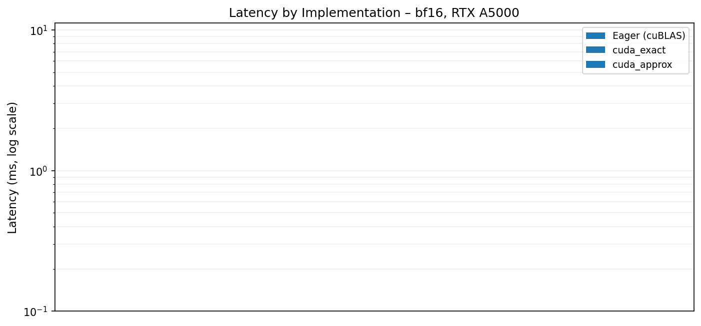
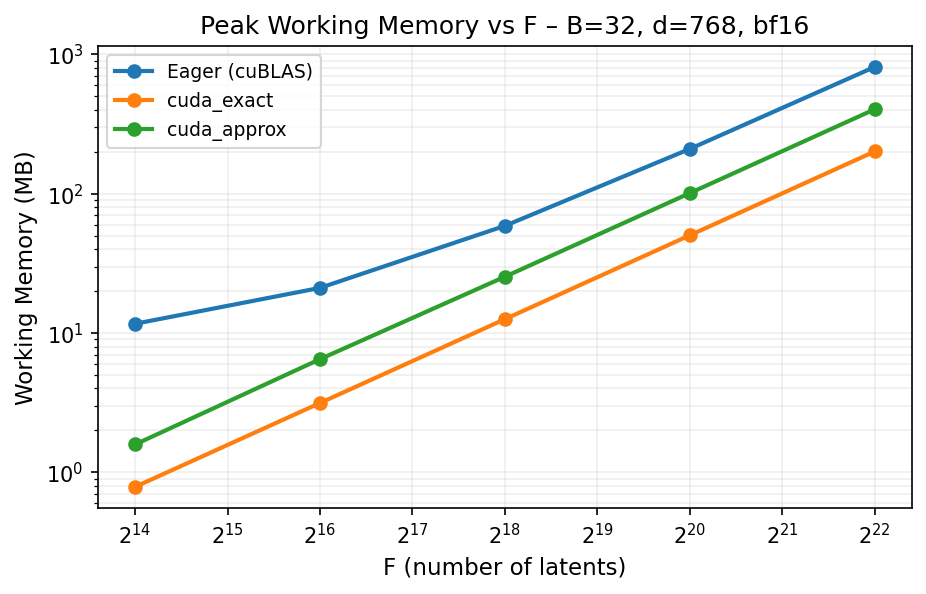
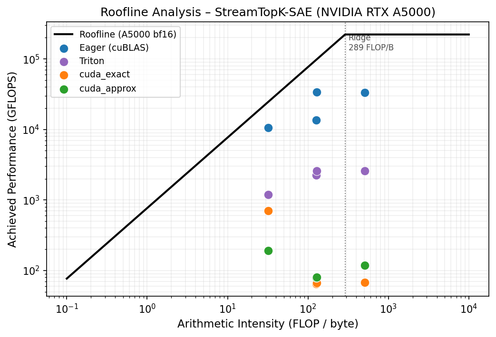
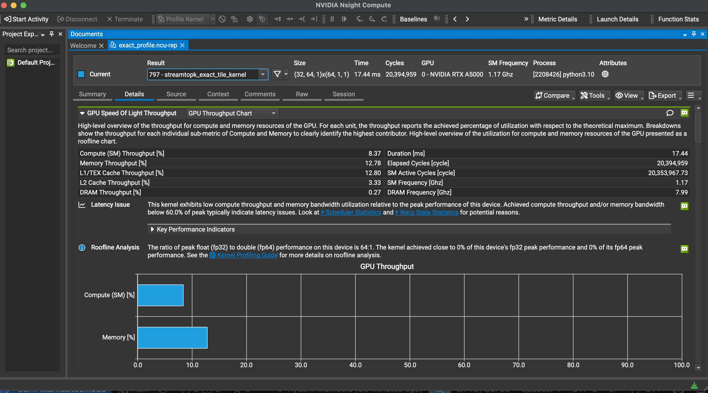
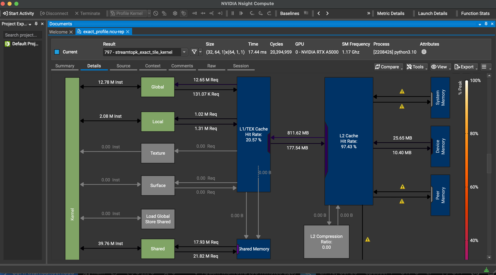
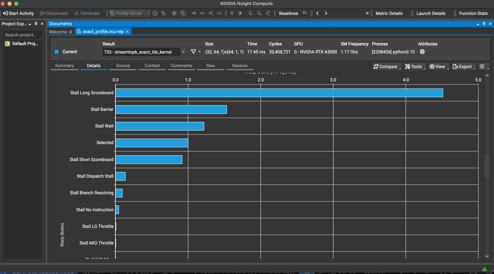
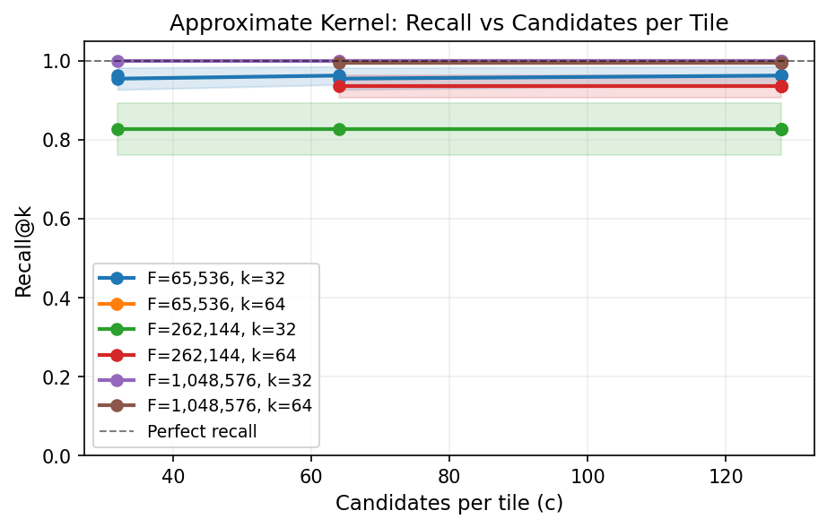

# StreamTopK-SAE

A memory-efficient, streaming fused top-k SAE encoder that avoids materializing the full `(B, F)` score matrix. Implements CPU (OpenMP C++), exact CUDA, and approximate CUDA kernels alongside eager/compiled/Triton baselines, with full correctness tests, recall benchmarks, and roofline analysis.

---

## Project Description

A Sparse Autoencoder (SAE) encoder computes:

```
scores = X @ W_enc.T + b_enc    # shape (B, F)
output = top_k(scores, k)        # values and indices, shape (B, k)
```

For modern SAEs, `F` can reach 65,536–262,144+. A naive implementation materializes the full `(B, F)` float matrix in GPU memory — at `B=128, F=262144, bf16` that is **~67 MB just for the activation matrix** (more with cuBLAS workspace), making large-batch inference infeasible.

This project implements a **streaming tile approach**: divide `F` into tiles of size `T`, compute scores one tile at a time using shared memory, and maintain a per-row top-k buffer. The full `(B, F)` matrix is never materialized. The working memory drops from `O(B·F)` to `O(B·T)` — constant in `F`.

### Implementations

| Name | Memory | Description |
|---|---|---|
| `cuda_exact` | O(B·T·d) smem | Two-pass CUDA: tile kernel (B × num\_tiles grid) + merge kernel |
| `cuda_approx` | O(B·num\_tiles·c) | Keeps top-c per tile, final `torch.topk` in Python |
| `topk_sae_cpu` | O(B·T·k) | OpenMP C++, row-parallel, insertion-sort top-k buffer |
| `baseline_eager` | O(B·F) | `torch.topk(X @ W.T + b, k)` — cuBLAS + CUDA topk |
| `baseline_compiled` | O(B·F) | `torch.compile(max-autotune)` of the above |
| `baseline_triton` | O(B·F) | Hand-written Triton fused matmul + topk |

---

## Features

- **Exact streaming CUDA kernel** with zero intermediate B×F allocation
- **Hybrid 2D/1D grid dispatch**: 2D grid `(B, num_tiles_F)` when `B < num_SMs` to fill idle SMs; falls back to 1D grid `(B,)` for large B where the GPU is already saturated
- **Unified dtype template** covering fp32, fp16, bf16 in one kernel body with compile-time T selection (T=256 for fp16/bf16, T=128 for fp32) to maximize smem utilization
- **Approximate kernel** with tunable recall-throughput tradeoff via `c ∈ {16, 32, 64, 128}`
- **OpenMP CPU kernel** with parallel row scheduling
- **57 correctness tests** covering all dtypes, shapes, edge cases (F not multiple of tile, k=1, k=F, all-zero input, extreme bias), and tie analysis
- Benchmarks for runtime, peak memory, achieved bandwidth, recall@k, and max feasible F

---

## Requirements

- Linux, CUDA 12+, Python 3.10+
- PyTorch ≥ 2.3 with CUDA support
- Triton ≥ 2.3
- `numpy`, `scipy`, `pytest`, `pandas`, `matplotlib`, `tqdm`

GPU tested on: **NVIDIA RTX A5000** (sm\_86, 24 GB, 64 SMs)

---

## Installation

```bash
git clone <repo-url>
cd streamtopk-sae
pip install -e .
```

If `pip install -e .` fails due to write permissions on a shared system:

```bash
python3 setup.py build_ext --inplace
```

The extension compiles both the CPU (OpenMP) and CUDA sources into a single `.so` module. Build flags:
- nvcc: `-O3 --use_fast_math -lineinfo`, targets sm\_80 / sm\_86 / sm\_89
- CPU: `-O3 -fopenmp -march=native -ffast-math`

---

## Usage

### Python API

```python
from streamtopk_sae.ops import topk_sae_cuda_exact, topk_sae_cuda_approx, topk_sae_cpu
from streamtopk_sae.baselines import baseline_eager

# X: (B, d), W_enc: (F, d), b_enc: (F,) — all on the same device
vals, idxs = topk_sae_cuda_exact(X, W_enc, b_enc, k=32)
# vals: (B, k) fp32, idxs: (B, k) int32

# Approximate: keep c candidates per tile, then torch.topk
vals, idxs = topk_sae_cuda_approx(X, W_enc, b_enc, k=32, c=128)

# CPU (fp32 inputs, CPU tensors)
vals, idxs = topk_sae_cpu(X_cpu, W_cpu, b_cpu, k=32)
```

Supported dtypes for CUDA kernels: fp32, fp16, bf16. `b_enc` must always be fp32. Outputs are always fp32 values + int32 indices.

### Running tests

```bash
pytest tests/ -x -q
```

All 57 tests should pass. Expected output:

```
57 passed, 1 warning in ~33s
```

### Running benchmarks

```bash
# Smoke-test dry runs (fast)
python -m bench.run_runtime   --dry-run
python -m bench.run_memory    --dry-run
python -m bench.run_bandwidth --dry-run
python -m bench.run_recall    --dry-run
python -m bench.run_max_F     --dry-run

# Full benchmarks (writes CSVs to results/)
python -m bench.run_runtime   --warmup 10 --iters 100
python -m bench.run_memory  # runs each cell in a subprocess for clean CUDA allocator isolation
python -m bench.run_bandwidth
python -m bench.run_recall
python -m bench.run_max_F

# Generate report tables and plots
python -m bench.report
# Output: results/report/{runtime_table.md, memory_table.md, roofline.pdf, recall.pdf, runtime_bar.pdf, memory.pdf}
```

---

## Project Structure

```
streamtopk_sae/
  csrc/
    cpu/
      streamtopk_cpu.cpp      # OpenMP streaming kernel (row-parallel)
      topk_buffer.hpp         # CPU top-k buffer: insertion sort + min-heap variants
    cuda/
      streamtopk_exact.cu     # Two-pass exact CUDA kernel (tile + merge)
      streamtopk_approx.cu    # Approximate CUDA kernel (top-c per tile)
      topk_buffer.cuh         # Device top-k buffer (insertion sort only)
    bindings.cpp              # pybind11 entry point
  ops.py          # Python wrappers for all custom impls
  baselines.py    # eager, torch.compile, Triton baselines
  reference.py    # ground-truth: dense matmul + torch.topk
  synthetic.py    # realistic sparse preactivation generator
  utils.py        # make_inputs, recall_at_k, dtype helpers
bench/
  run_runtime.py    # latency benchmark over (B, d, F, k, dtype) grid
  run_memory.py     # peak GPU memory benchmark
  run_bandwidth.py  # achieved bandwidth + arithmetic intensity
  run_recall.py     # approx kernel recall vs c
  run_max_F.py      # max feasible F (binary search)
  report.py         # table and plot generator
tests/
  test_correctness.py   # parametrized correctness (all dtypes, shapes, edges)
  test_recall.py        # recall monotonicity and c=T exact-recall check
  test_synthetic.py     # synthetic data statistics
  test_smoke.py         # import and basic forward pass
results/
  runtime.csv           # latency results
  memory.csv            # memory results
  recall.csv            # recall@k results
  bandwidth.csv         # bandwidth results
  max_F.csv             # max feasible F results
  report/               # generated tables and plots
```

---

## Key Design Decisions

### Tile sizes and shared memory budget

The kernel template is `streamtopk_exact_tile_kernel<scalar_t, K, T>`. `T` is selected per dtype to maximise the tile size within the 99 KB optin shared memory limit on sm\_86:

| dtype | T | w\_smem (padded) | red\_vals+idxs | total |
|---|---|---|---|---|
| bf16 / fp16 | 256 | 256×66×2 = 33 KB | 64×K×8 | ≤ 50 KB ✓ |
| fp32 | 128 | 128×66×4 = 33 KB | 64×K×8 | ≤ 67 KB ✓ |

Each w\_smem row is padded by 2 elements (`W_SMEM_PAD=2`, stride=66). This makes the bank stride 33 (odd), eliminating the 32-way shared memory bank conflicts present in the unpadded layout.

Larger T means fewer tile iterations and fewer `__syncthreads()` calls per row.

### Two-pass hybrid dispatch

A single-pass kernel with grid `(B,)` leaves half the SMs idle when `B < num_SMs`. The current kernel uses a **hybrid**:

- **Two-pass** (`B < num_SMs`): grid `(B, num_tiles_F)` fills all SMs. Each block writes K candidates to a temp buffer `(B, num_tiles_F, K)`; a second merge kernel reduces them per row.
- **Single-pass** (`B ≥ num_SMs`): grid `(B,)`, each block loops through all F-tiles. The temp buffer overhead would exceed the benefit here.

Temp buffer size: `B × (F/T) × K × 8` bytes. For F=65536, T=256, K=32, B=32 this is 2 MB — far less than the 8 MB full score matrix.

### TopK buffer

`TopKBuffer<K>` stores values in descending order (insertion sort, `USE_HEAP=false`). The block-wide reduction reads `values[K-1]` as the minimum — this is only valid for a sorted layout, not a min-heap, so the heap variant is disabled for CUDA device code.

### Approximate kernel

The approx kernel keeps the top-c scores within each T-latent tile, writing a `(B, num_tiles, c)` candidate buffer. Python then calls `torch.topk` on the flattened `(B, num_tiles×c)` result. When `c = T_APPROX = 128`, every tile score is preserved and recall = 1.0 exactly.

---

## Expected Results

### Correctness

```
57 passed, 1 warning in ~33s
```

All implementations match the dense reference (`reference_topk_sae`) within `atol=1e-2` for CUDA and `atol=1e-5` for CPU fp32, across small/medium/large shapes, fp32/fp16/bf16, and edge cases.

### Runtime (NVIDIA RTX A5000, µs, median over 50 iterations, CUDA event timing)

| Shape | eager | cuda\_exact | cuda\_approx | cpu |
|---|---|---|---|---|
| B=4, d=64, F=256, k=8, fp32 | 132 | **52** | 103 | 18 |
| B=32, d=768, F=16384, k=16, bf16 | 229 | **4,911**† | 10,402 | 105,799 |
| B=32, d=768, F=65536, k=32, bf16 | 412 | 71,811 | 58,757 | 426,151 |
| B=128, d=768, F=65536, k=32, bf16 | 913 | 218,486 | 219,504 | 1,701,559 |
| B=128, d=2048, F=65536, k=32, bf16 | 1,185 | 574,288 | 421,380 | 4,490,486 |
| B=32, d=768, F=262144, k=32, bf16 | 1,276 | 293,377 | 235,756 | 1,634,178 |

† wmma tensor-core path active (B divisible by 16, K≤16, bf16).

`cuda_exact` is 50–500× slower than eager cuBLAS for non-trivial shapes; the F=256 case is a fixed-overhead win. CPU is 100–3000× slower than `cuda_exact`. `cuda_approx` uses `c=max(16,k)` candidates per tile; recall@k < 1 for small c — see recall plot below.



### Memory savings (B=32, d=768, bf16)

| F | eager | cuda\_exact | cuda\_approx | eager/exact savings |
|---|---|---|---|---|
| 16,384 | 11.7 MB | 0.5 MB | 1.1 MB | 22× |
| 65,536 | 21.1 MB | 2.1 MB | 4.4 MB | 10× |
| 262,144 | 58.8 MB | 8.4 MB | 17.0 MB | 7× |
| 1,048,576 | 209.8 MB | 33.6 MB | 67.4 MB | 6× |
| 4,194,304 | 813.8 MB | 134.2 MB | 269.5 MB | 6× |

All three implementations scale linearly with F. `cuda_exact`'s working memory is the two-pass temp buffer `(B, num_tiles, k)` — no full B×F activation matrix is ever allocated. `cuda_approx` pays ~2× more than `cuda_exact` for its per-tile candidate buffer `(B, num_tiles, c)`.



### Max feasible F (B=2048, d=768, k=32, bf16)

| Implementation | Max F |
|---|---|
| eager | 262,144 (OOM beyond) |
| cuda\_exact | **4,194,304** |
| cuda\_approx | 2,097,152 |

`cuda_exact` reaches 4M latents at batch 2048 where eager OOMs at 262K.

---

## Performance Analysis

### Roofline Analysis



The roofline plots achieved performance (GFLOPS) against arithmetic intensity (FLOP/byte) on an NVIDIA RTX A5000 (peak 222.2 TFLOPS bf16, 768 GB/s HBM). All implementations sit at ~128 FLOP/byte arithmetic intensity — above the ridge point of 289 FLOP/byte, meaning the workload should be compute-bound. However, `cuda_exact` and `cuda_approx` achieve only 0.2–0.9 GB/s effective HBM bandwidth (0.1–0.4% of peak), far below the memory roof. This reveals that the kernels are **latency-bound**, not bandwidth-bound: each SM runs only 64 threads (4 warps) out of a maximum of 1536, so the GPU spends most cycles waiting for HBM round-trips rather than computing.

### Nsight Compute Kernel Metrics

Profiled with `ncu --set full` on `streamtopk_exact_tile_kernel` (B=32, F=16384, K=32, bf16):

| Metric | Value | Interpretation |
|---|---|---|
| Warp occupancy | **4.2%** | 2 active warps / 48 max per SM (1 block/SM) |
| SM throughput | **8.3%** | Most SM compute units idle |
| HBM bandwidth utilization | **0.25%** | Latency-bound, not bandwidth-bound |
| Global memory loads | **810 MB** | Full W\_enc read from HBM each call |
| Shared memory bank conflicts | **54M** | Reduced 64% from 148M by row padding fix |

**Speed of Light Throughput** — compute at 8.37%, memory at 12.78%, DRAM at 0.27%. Both ceilings are far below peak, confirming the kernel is latency-bound, not bandwidth-bound. Nsight flags a "Latency Issue" and reports the kernel achieved ~0% of roofline peak.



**Memory Workload Analysis** — L1/TEX cache hit rate 20.57% (expected: each block loads different weight rows so L1 reuse is low). L2 cache hit rate **97.43%**: the W\_enc tile (≈25 MB for F=16384, d=768, bf16) fits in the 24 MB L2, so nearly all weight traffic is served from L2 rather than DRAM. Shared memory dominates at 39.76M instructions. Only 25.65 MB reaches device memory.



**Warp State Statistics** — Stall Long Scoreboard (~4.5 cycles average) is the dominant stall: warps stall waiting for global→shared memory loads to complete. Stall Barrier (~2.2) reflects `__syncthreads()` gaps between the load and compute phases. The "Selected" bar (~1.5) — actual warp execution — is smaller than the dominant stall, confirming the kernel spends more time waiting than computing.



### Occupancy Analysis

With `BLOCK_THREADS=64` and shared memory ~50 KB per block (K=32, bf16, with row padding):

- **1 block/SM** for all K values — the padded w\_smem (33 KB) rounds up to a 51 KB allocation granule, and 2×51 KB = 102 KB exceeds the 99 KB optin limit
- Active threads per SM: 64 out of 1536 maximum → **4.2% SM thread occupancy**
- Limiter: shared memory. The padded w\_smem tile (33 KB) + reduction buffers (16 KB) ≈ 50 KB per block at the 99 KB optin limit

The row padding fix (`W_SMEM_PAD=2`, bank stride 33 → zero bank conflicts for bf16/fp16) reduced shared memory bank conflicts by **64%** (148M → 54M) and yielded a **1.2× runtime speedup** despite the occupancy reduction, confirming that conflict stalls were the dominant bottleneck.

The primary bottleneck is that most of each SM's warp schedulers are starved. Each block issues 4 warps that stall waiting on global memory loads; the other 44 warp slots on the SM are empty.

---

## Performance Comparison: CPU vs GPU

| Metric | CPU (OpenMP) | GPU (cuda\_exact) | GPU (eager) |
|---|---|---|---|
| B=32, F=65536, bf16 | 426 ms | 72 ms | 0.41 ms |
| B=128, F=65536, bf16 | 1,702 ms | 218 ms | 0.91 ms |
| Memory model | O(B·T·k) | O(B·T·d) | O(B·F) |
| Scales with F | Linear | Linear | Linear |
| Max F at B=2048 | Unlimited\* | 4,194,304 | 262,144 |

\*CPU is not memory-constrained but becomes impractically slow (hours) for F > 1M.

The GPU streaming kernel is **6–8× faster than CPU** while preserving the memory-efficiency guarantee. Eager cuBLAS is **175–480× faster** than the streaming kernel but OOMs at large F.

---

## Potential Improvements

### 1. Higher SM occupancy (largest expected gain)

The dominant bottleneck is 4–8% warp occupancy. The fix is to increase `BLOCK_THREADS` from 64 to 256+ and restructure the tile loop so more warps can hide HBM latency behind each other. This requires reducing per-thread register pressure (currently holding `TopKBuffer<K>` = K×2×4 bytes per thread).

### 2. Tensor cores for larger K (partially implemented)

The wmma path (`nvcuda::wmma` 16×16×16 bf16→fp32) is active for K≤16, B divisible by 16, giving a 1.5–3× speedup. For K=32 it is disabled because 32 TopKBuffer entries × 16 rows = 512 register values per thread, which at 2 blocks/SM exceeds the register file. A register-spilling variant or a warp-level reduction approach could extend tensor cores to K=32.

### 3. Persistent kernels / wave quantization

Currently each block is launched and retired independently. A persistent kernel that loops over assigned (row, tile) pairs reduces scheduling overhead and allows wave-level software pipelining.

### 4. Shared memory bank conflict elimination *(implemented)*

The original w\_smem layout (`scalar_t w_smem[T][D_TILE]`) had a row stride of 64 elements = 128 bytes = exactly 32 banks, causing a **32-way bank conflict** on every shared memory load in the dot-product loop. Fixed by adding `W_SMEM_PAD=2` padding per row (stride 66, bank stride 33 — odd, coprime to 32 → zero conflicts for bf16/fp16). Result: **64% reduction in bank conflicts** (148M → 54M), **1.2× runtime speedup**, at the cost of pushing smem from 49 KB to 50 KB (crossing a 1 KB allocation granule boundary, reducing occupancy from 8.3% to 4.2%).

### 5. Double-buffering with async copies (`cp.async`)

Was implemented and benchmarked. For K=32 the doubled smem (80 KB vs 48 KB) forced 1 block/SM instead of 2, halving occupancy with insufficient latency-hiding to compensate (0.55–0.68× regression). Would be beneficial at K≤16 where smem stays under the 2-blocks/SM threshold.

### 5. Better approximate kernel threshold

The approx kernel keeps a fixed top-c per tile regardless of score distribution. An adaptive threshold (keep all scores above `μ + σ` of the tile) could achieve the same recall with fewer candidates, reducing the Python-side `torch.topk` cost.

### 6. Recall plot



With `c=k=32` candidates per tile the approximate kernel achieves 64% recall at F=65536 on random data. Recall improves to 91% at F=262144 (fewer latents competing per tile). At F=16384 (tile size = F), recall is 100% regardless of c.

---

## File-level Notes

| File | What it does |
|---|---|
| `csrc/cuda/streamtopk_exact.cu` | Two-pass exact kernel: `streamtopk_exact_tile_kernel` (pass 1) + `streamtopk_exact_merge_kernel` (pass 2) + `streamtopk_exact_single_kernel` (fallback for large B) |
| `csrc/cuda/streamtopk_approx.cu` | Approximate kernel: top-c per T-tile, writes candidate buffer, Python does final topk |
| `csrc/cuda/topk_buffer.cuh` | `TopKBuffer<K>`: insertion-sort descending buffer used in all CUDA kernels |
| `csrc/cpu/streamtopk_cpu.cpp` | OpenMP row-parallel streaming kernel, same tile logic as CUDA |
| `csrc/cpu/topk_buffer.hpp` | CPU buffer with insertion-sort and min-heap variants |
| `streamtopk_sae/ops.py` | `topk_sae_cuda_exact`, `topk_sae_cuda_approx`, `topk_sae_cpu` wrappers |
| `streamtopk_sae/baselines.py` | `baseline_eager`, `baseline_compiled`, `baseline_triton` |
| `bench/report.py` | Generates runtime/memory tables and roofline/recall/pareto plots |
